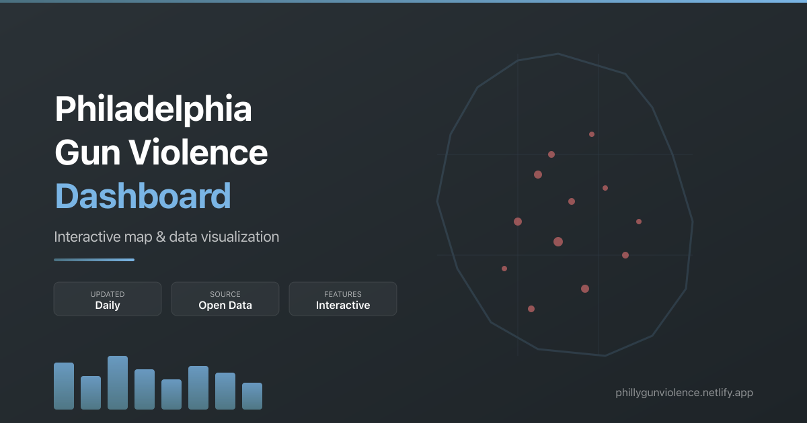

<p align="center">
  
</p>

# Philadelphia Gun Violence Dashboard

[](https://github.com/nickhand/philly-gun-violence-dashboard/actions/workflows/daily-shootings-sync.yml)
[](https://github.com/nickhand/philly-gun-violence-dashboard/actions/workflows/daily-homicide-sync.yml)
[](https://github.com/nickhand/philly-gun-violence-dashboard/actions/workflows/courts-process.yml)

A full-stack data platform, API, and Nuxt dashboard for exploring public gun violence data in Philadelphia.
Visit the live map: https://nickhand.dev/philly-gun-violence-map

## What This Demonstrates

- Production-style geospatial data engineering: extract, validate, enrich, version, and serve public datasets.
- Typed Python package boundaries across ETL, shared utilities, scraper orchestration, and API code.
- A FastAPI backend designed around immutable, versioned NDJSON payloads for efficient frontend caching.
- A Nuxt/MapLibre/D3 frontend for map-first analysis with synchronized charts and filters.
- Operational automation with GitHub Actions, AWS S3, ECS/SQS scraper workers, Fly.io, and Cloudflare Workers.

## System Overview

```text
public data sources
  -> Python ETL jobs
  -> immutable S3 releases + atomic pointers
  -> FastAPI atomic in-memory snapshot + versioned endpoints
  -> Nuxt dashboard on Cloudflare Workers

Pennsylvania court portal
  -> SQS work queue
  -> ECS/Fargate scraper workers
  -> S3 per-incident results
  -> courts processing workflow
```

The API loads processed data from S3, builds in-memory indexes, and exposes
content-addressed URLs such as `/shootings/rows/{version}/{year}.ndjson`. The
frontend converts those rows to GeoJSON client-side, which keeps network payloads
small and cacheable while still supporting map interaction.

Infrastructure is provisioned outside this repository. The repo documents the
runtime contracts - environment variables, container commands, S3 keys, and ECS/SQS
expectations - without coupling the application to a specific IaC implementation.

## What This Repo Contains

- **Nuxt dashboard** with interactive maps and data visualizations.
- **FastAPI service** for geospatial endpoints and dashboard data.
- **ETL pipelines** that ingest, clean, and enrich shootings, homicides, courts, and boundaries data.
- **Shared utilities** for AWS/S3 access and shared data models.
- **Automation** via GitHub Actions, Fly.io, Cloudflare Workers, and AWS-managed data storage.

## Highlights
- End-to-end geospatial data platform powering a public dashboard used by civic audiences.
- Nuxt frontend with MapLibre GL maps, D3.js charts, and the project civic UI layer.
- Automated ETL pipelines with scheduled refreshes, validation, and S3-backed storage.
- FastAPI service optimized for large GeoJSON payloads with pagination and caching.
- Shared, typed data models across ETL and API for consistent contracts.
- Production deployment on Fly.io (API) and Cloudflare Workers (frontend) with tested rollback paths.

## Background and data sources
This application began as a civic data dashboard and now runs as an independently maintained public project.

It relies only on public data sources:
- **Shooting victims**: City of Philadelphia open data (OpenDataPhilly.org)
- **Homicide totals**: Philadelphia Police Department crime statistics site
- **Court search**: Pennsylvania Unified Judicial System web portal

## Methods and caveats
- Shooting victims data is updated daily on OpenDataPhilly (typically by ~10:30am on weekdays).
- Homicide totals include all homicide types, not just firearm-related incidents.
- All data is preliminary and may differ from other public incident datasets.
- Court-search flags report whether an automated DC-number search of the
  Pennsylvania UJS portal returned a result; updates run weekly. A result does
  not establish how a record relates to a victim or report a case outcome.

See [docs/data-sources.md](docs/data-sources.md) for source details and caveats.

## Quick start
Prereqs: Python 3.13, `uv`, `just`, AWS CLI, and Fly CLI for API deploys.

1) Create `.env` from `.env.example` and set the AWS region, bucket, and local credential profile.
2) Run the API locally:

```bash
just api-dev
```

3) Run ETL jobs (examples):

```bash
just etl-shootings
just etl-homicides
just etl-courts
just etl-streets
```

4) Pull down S3 data locally (optional):

```bash
just data-sync
```

## Data flow (high level)
1. **ETL** jobs validate complete candidates, upload immutable objects, and move one stable release pointer.
2. **API** loads and validates a complete S3 release, then atomically swaps one frozen in-memory snapshot.
3. **Frontend** fetches metadata, then loads content-addressed year-specific NDJSON data on demand.
4. **A Fly scheduler** dispatches GitHub Actions ETL, production-smoke, and
   weekly dependency-security workflows. During the guarded scheduler cutover,
   GitHub remains the sole owner of the weekly frontend-quality schedule until
   a separate phase-2 handoff, so a deploy cannot create a monitoring gap.
5. **Nuxt** owns crawler-visible HTML, robots, and sitemaps on Cloudflare while `/stats.json` supplies its server-rendered figures.

For more detail, see [docs/architecture.md](docs/architecture.md).

## API design
The shootings endpoint uses a versioned, content-addressed caching strategy:
- `GET /shootings/meta` — Returns version hash, available years, and per-year URLs
- `GET /shootings/rows/{version}/{year}.ndjson` — Year-specific data (immutable, cached 1 year)
- `GET /stats.json` — Typed statistics snapshot consumed during Nuxt server rendering
- `GET /ready` — Snapshot freshness/readiness without conflating stale data with process liveness

The frontend builds GeoJSON client-side from the NDJSON rows, avoiding duplicate data transfer.

## Repo structure
```
packages/api/               FastAPI service
packages/etl/               ETL pipelines and CLI
packages/dashboard-utils/   Shared AWS + data utilities + models
packages/aws-batch-scraper/ Reusable ECS/SQS scraper framework
frontend/                    Nuxt frontend application and civic UI layer
```

## Known Limitations

- Source data is preliminary and can change after publication.
- Court-search results depend on public portal behavior and may be unknown or miss
  records when source systems change, records are delayed, or incident identifiers
  are absent. An explicit no-results response does not prove that no case exists.
- The courts scraper is intentionally isolated behind SQS/ECS workers because it
  depends on a stateful external portal.
- Infrastructure is documented as runtime contracts rather than checked-in IaC.

## Frontend

The canonical dashboard is a Nuxt application with server-rendered content routes
and a client-rendered interactive map. The former Vite SPA remains only as a
temporary rollback build while the Cloudflare migration is observed.

**Tech stack:**
- **Nuxt 4 / Vue 3** with Composition API
- **Project civic UI layer** built from accessible, reusable components
- **MapLibre GL** for interactive mapping
- **D3.js** for data visualizations and charts
- **Arquero** for in-browser data filtering
- **Pinia** for state management
- **Vite** for build tooling

**Project structure:**
```
frontend/app/       Nuxt pages, components, composables, and utilities
frontend/layers/    Reusable civic UI layer
frontend/server/    Server endpoints used by the Nuxt renderer
frontend/tests/     Unit, SSR/SEO, accessibility, and browser contracts
```

**Development:**
```bash
cd frontend
npm ci
npm run dev:nuxt
npm run build:nuxt
```

**Deployment:**
The canonical frontend is the `philly-gun-violence-dashboard-production`
Cloudflare Worker on the exact `/philly-gun-violence-map` namespace. GitHub
Actions validates pushes; production deployment remains an explicit release
step via `npm run deploy:nuxt:production` after CI succeeds. The legacy Netlify
site is retained only for the documented rollback window. Its checked-in build
ignore rule cancels every Git-triggered build, so pushing this repository cannot
silently replace the frozen rollback origin.

## Deployment (Fly.io)
- `fly.toml` defines the public API app.
- `fly.scheduler.toml` defines the credential-isolated external scheduler.
- `packages/api/Dockerfile` builds the shared image; each app runs only its own process.

The first rollout is reader-first. Set the GitHub Actions variable
`EXPECT_ATOMIC_RELEASE=false`, configure the production-smoke heartbeat, and
grant the Fly API identity `s3:GetObject` for
`public/downloads/manifest.json` before deploying. The updated scheduler checks
out current `main`, so deploying it also enables the updated atomic writers.
Deploy and prove the 1 GB pointer-aware API against the legacy objects before
handing off any schedule.

```bash
just fly-secrets-api
just fly-deploy-api              # require /health and legacy-backed /ready
just fly-create-scheduler        # one time only; skip if it exists
just fly-secrets-scheduler
just fly-stop-legacy-scheduler   # quiet window; no active GitHub/ECS work
just fly-deploy-scheduler        # require one Machine and one successful dispatch
just fly-remove-legacy-api-token # only after the scheduler proof
```

Preserve the quiet gap: never start the new scheduler while an API `cron`
Machine or previously dispatched GitHub/ECS job is active. After the reader is
live, publish complete immutable objects before moving each release pointer;
shootings and homicides migrate first through their updated jobs, while the
boundary writer retains its separate reader-first gate. Set
`EXPECT_ATOMIC_RELEASE=true` only after all three release pointers are live and
verified. The full cutover and rollback checks are in
`packages/api/README.md`.

## Portfolio
If this project is useful or you want to collaborate, check out:
https://nickhand.dev

## Feedback
Please open an issue: https://github.com/nickhand/philly-gun-violence-dashboard/issues
